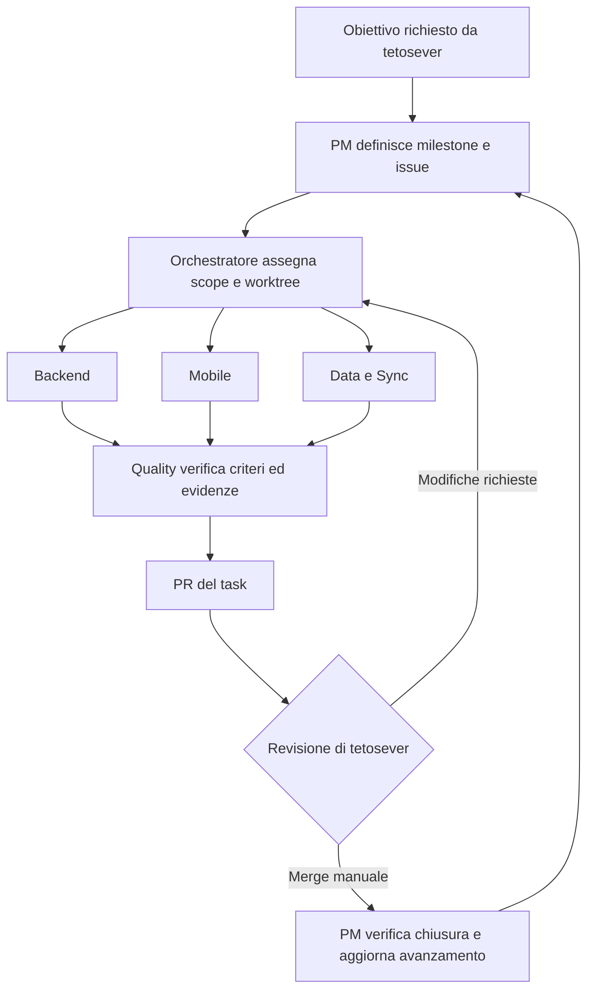

# Sistema multi-agent ListaViva

Il PM trasforma le milestone in issue verificabili. L'orchestratore assegna le issue pronte a specialisti, raccoglie verifiche indipendenti e apre una PR per task. **Tetosever decide l'accettazione e fa il merge manuale.**

## Architettura



## Ruoli e caricamento

| Ruolo | Istruzioni | Responsabilità |
| --- | --- | --- |
| Orchestratore | [orchestrator.md](roles/orchestrator.md) | Piano, dipendenze, delega, integrazione per issue e PR |
| PM | [pm.md](roles/pm.md) | Backlog, user story, issue, milestone e stato reale |
| Backend | [backend.md](roles/backend.md) | API e logica applicativa |
| Mobile | [mobile.md](roles/mobile.md) | Expo, esperienza utente e viste locali |
| Data e Sync | [data-sync.md](roles/data-sync.md) | Schema, migrazioni, protocollo offline e riconciliazione |
| Quality | [quality.md](roles/quality.md) | Verifica indipendente, isolamento e regressioni |

Le skills sono procedure versionate in [skills](skills/). I ruoli indicano quali leggere. La cartella `agents` contiene il modello operativo; `.codex/agents/*.toml` contiene gli adattatori per i sub-agent di progetto e `.codex/config.toml` il limite di concorrenza. Nessun modello viene imposto: viene ereditata la scelta della sessione. Queste configurazioni non sono un daemon e non avviano autonomamente l'implementazione al commit.

## Avvio

Aprire il checkout del branch in un ambiente Codex che supporti sub-agent di progetto e l'accesso GitHub, quindi usare:

> Agisci come orchestratore ListaViva. Leggi AGENTS.md e agents/README.md. Chiedi al PM di valutare le dipendenze della issue #N. Se è pronta, implementala con gli specialisti necessari, ciascuno con file assegnati, e apri una PR. Fermati alla revisione di tetosever.

Per la sola pianificazione:

> Agisci come PM ListaViva. Raffina le issue della milestone M1 con scope, criteri di accettazione e dipendenze. Segnala i blocchi. Non avviare l'implementazione.

L'orchestratore è normalmente la sessione principale. I ruoli `pm`, `backend`, `mobile`, `data_sync`, `quality` sono delegabili. Il ruolo custom `orchestrator` è disponibile per un incarico esplicito, senza creare orchestratori ricorsivi. Se l'ambiente espone solo un worker generico, passargli il ruolo e il task completo tramite gli strumenti di delega disponibili. Se non espone delega, dichiarare il limite e usare le stesse fasi in sequenza, senza simulare sub-agent reali.

## Tracking e milestone

Il catalogo iniziale è [backlog/catalog.json](backlog/catalog.json). M1 è il primo rilascio funzionale; M2–M6 sono backlog da raffinare prima dell'esecuzione. Le dipendenze sono ID stabili (`M1-01`), convertiti in link alle issue durante la pubblicazione. Ogni task ha story, scope, esclusioni, criteri, owner e stima di lavoro effettivo. Le stime non sostituiscono la roadmap part time e le osservazioni utenti possono richiedere settimane di calendario.

```bash
# Anteprima locale senza credenziali o scritture remote
python3 agents/scripts/pm_sync.py

# Pubblicazione idempotente usando GH_TOKEN già presente nell'ambiente
python3 agents/scripts/pm_sync.py --apply

# Riepilogo remoto in sola lettura
python3 agents/scripts/pm_sync.py --status
```

Il comando crea milestone native, label e issue mancanti. Non riapre task chiusi, non crea branch per task non iniziati e non cancella issue. Gli scope pubblicati possono essere raffinati dal PM nelle issue; il catalogo è il seed e gli ID rimangono stabili. Non eseguire due seed contemporaneamente. Il workflow **PM backlog** serializza le pubblicazioni e, per il setup autorizzato, si esegue sulla PR del branch `chore/multi-agent-setup` aperta dal proprietario. Dopo il merge può essere eseguito manualmente dalla scheda Actions. Non è necessaria una chiave OpenAI per questi strumenti di tracking.

### Stati

`status:backlog` → `status:ready` → `status:in-progress` → `status:in-review` → `status:done`; `status:blocked` indica un impedimento documentato. Il PM mantiene una sola label di stato per task e registra il motivo di ogni blocco. La creazione del backlog parte da Backlog. La pubblicazione non dichiara alcuna funzionalità implementata.

Una issue chiusa senza PR merged non dimostra completamento; la cancellazione va rendicontata separatamente. Il PM verifica la PR e l'evidenza prima di assegnare Done. Gli OKR di retention e uso reale sono misurati separatamente dalla percentuale di issue chiuse.

## Revisione umana e limiti

Il workflow valida struttura e contratto issue/branch/PR. CODEOWNERS indica `@tetosever`. **Le istruzioni e CODEOWNERS da soli non bloccano il pulsante Merge**: la protezione effettiva di `main` va configurata nelle regole GitHub con PR obbligatoria, controlli richiesti e review secondo il modello di identità scelto. Questo setup non dichiara attive regole di protezione non verificate.

Se la connessione crea la PR come `tetosever`, GitHub non gli consente di approvare formalmente la propria PR. Può commentare e fare il merge manualmente come accettazione. Per una review formale obbligatoria da `tetosever`, le PR future devono essere aperte da un'identità bot/collaboratore distinta con accesso autorizzato. Gli agenti non aggirano questa limitazione.

## Verifica locale e fonti

Richiede Python 3.11+; gli script di tracking usano la libreria standard.

```bash
python3 agents/scripts/validate.py
python3 -m unittest discover -s agents/tests -v
```

- [Subagents e configurazioni TOML di progetto](https://learn.chatgpt.com/docs/agent-configuration/subagents), consultato il 24 settembre 2026.
- [GitHub milestone API](https://docs.github.com/en/rest/issues/milestones).
- [Revisione delle pull request](https://docs.github.com/en/pull-requests/how-tos/review-pull-requests/reviewing-proposed-changes-in-a-pull-request).

La configurazione è validata staticamente; l'esecuzione end-to-end sul Codex locale dell'utente richiede quel runtime e le relative credenziali. I ruoli Markdown restano riutilizzabili indipendentemente dall'adattatore.
