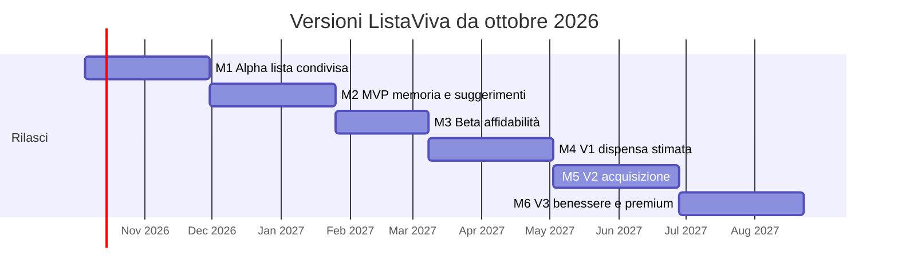

# Roadmap e OKR di ListaViva

Piano iniziale per uno sviluppo principalmente part time. Una milestone termina con una versione utilizzabile e con una decisione basata sull'uso reale. Le soglie riprese dal PRD sono obiettivi indicativi, non risultati osservati. Le date del diagramma sono un esempio a partire dal 5 ottobre 2026; se una milestone non supera il proprio gate, quella successiva va ripianificata.

## M1 — Lista condivisa · Alpha 0.1 · settimane 1–8

**Obiettivo:** consentire a due persone di organizzare la spesa in modo rapido e affidabile, anche con connettività intermittente.

**Output:** account, creazione nucleo e invito; più liste; aggiunta, quantità, note e check degli articoli; modalità spesa essenziale; persistenza locale, coda offline, sincronizzazione e gestione dei retry. La prima vertical slice comprende login → nucleo → invito → lista → sync → completamento.

**Risultati chiave:**

1. Nessuna operazione persa o duplicata nei test di riconnessione su due dispositivi; nessuna lettura o scrittura tra nuclei diversi nei test di autorizzazione.
2. Tempo mediano inferiore a 3 secondi per aggiungere un articolo recente nei test su dispositivi reali.
3. Alpha provata con 10–20 nuclei; almeno il 50% dei nuovi nuclei invita un'altra persona come target di attivazione da validare.

**Gate:** i nuclei completano spese vere senza dover ricostruire a mano la lista dopo un conflitto. Le interviste e il prototipo dei flussi principali fanno parte delle prime settimane della milestone.

## M2 — Memoria domestica · MVP 1.0 · settimane 9–16

**Obiettivo:** far emergere valore dalla cronologia della spesa, senza chiedere un inventario manuale.

**Output:** storico acquisti, riaggiunta con un tap, autocomplete domestico, prodotti ricorrenti, suggerimenti basati su frequenza e ultima spesa, spiegazione e feedback (aggiungi, ignora, rimanda, mai più). Mostrare un suggerimento di frequenza solo dopo almeno tre occasioni d'acquisto osservate.

**Risultati chiave:** almeno il 25% dei suggerimenti mostrati viene aggiunto; meno del 10% riceve “mai più” o rifiuti ripetuti. Registrare separatamente suggerimenti mostrati, aggiunti e soppressi, senza contare più acquisti della stessa lista come osservazioni indipendenti.

**Gate:** se i falsi positivi restano frequenti, migliorare la qualità degli eventi o sostituire il suggerimento con un reminder esplicito prima di introdurre una dispensa stimata.

## M3 — Affidabilità · Beta · settimane 17–22

**Obiettivo:** verificare l'uso ripetuto e preparare il rilascio pubblico.

**Output:** notifiche configurabili, preferenze e quiet hours, accessibilità della modalità spesa, export e cancellazione dati, osservabilità, backup e prova di ripristino, onboarding migliorato. Beta privata con 100–300 nuclei, seguita da una beta pubblica se il gate è superato.

**Risultati chiave:** retention alla settimana 4 almeno del 25%; almeno il 60% dei nuclei attivi ha due membri attivi; almeno il 30% usa la lista in tre settimane su quattro. Misurare inoltre conflitti di sync per 1.000 operazioni e richieste di supporto.

**Gate:** le persone tornano a usare la lista senza supporto individuale e gli errori di sincronizzazione sono identificabili e risolvibili.

## M4 — Dispensa probabilistica · V1 · settimane 23–30

**Obiettivo:** aiutare il nucleo a capire cosa potrebbe mancare, mantenendo evidente l'incertezza.

**Output:** stock stimato e confidenza, prodotti “sempre in casa”, correzione rapida; quantità, lotti e date solo se effettivamente verificati. Distinguere “da consumarsi entro” e “preferibilmente entro”.

**Risultati chiave:** misurare l'utilizzo della funzione, il numero di correzioni richieste e la variazione dell'uso settimanale rispetto ai nuclei che non la usano. Definire la soglia di rilascio dopo l'osservazione della beta, evitando un target numerico privo di baseline.

**Gate:** la dispensa fa risparmiare lavoro percepito agli utenti; se richiede troppe correzioni, semplificarla.

## M5 — Acquisizione semiautomatica · V2 · settimane 31–38

**Obiettivo:** ridurre il lavoro necessario per aggiornare storico e scorte.

**Output:** scanner barcode, import degli scontrini come bozza da confermare, matching dei prodotti domestici e schermata di revisione. Valutare le integrazioni retailer solo quando esiste un caso d'uso misurabile e un accesso ai dati affidabile.

**Risultati chiave:** misurare tempo risparmiato per spesa, articoli riconosciuti correttamente e numero di correzioni per scontrino su un campione reale.

**Gate:** rilasciare l'OCR solo se il risparmio netto di tempo supera chiaramente la revisione richiesta all'utente.

## M6 — Benessere e monetizzazione · V3 · settimane 39–46

**Obiettivo:** completare il prodotto con funzioni alimentari facoltative e un modello premium sostenuto dall'uso effettivo.

**Output:** preferenze e obiettivi opt in, possibili ricette legate alla dispensa e Plus Household, con gestione dell'abbonamento per nucleo. Verificare separatamente privacy, sicurezza alimentare e regole degli store prima del rilascio.

**Risultati chiave:** retention alla settimana 8 solida e almeno una funzione premium esplicitamente richiesta da nuclei attivi; interesse all'acquisto misurato prima dello sviluppo completo del billing. Le soglie economiche definitive saranno stabilite sui dati della beta.

**Gate:** rilasciare soltanto funzioni che aiutano la spesa quotidiana senza introdurre inserimento manuale o affermazioni alimentari non verificate.

## Timeline indicativa

Il PRD e il report tecnico in questa cartella spiegano requisiti e scelte di architettura. Questa roadmap è una sequenza di validazione: i gate possono cambiare priorità e date.
